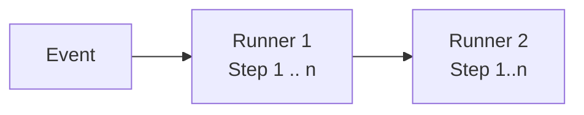

# GitHub Actions

## Overview
GitHub Actions is a continuous integration and continuous delivery (CI/CD) platform that allows you to automate your build, test and deployment pipelines. You can create workflows that build and test every pull request to your repository, or deploy merged pull request to production.

GitHub Actions goes beyond just DevOps and lets you run workflows when other events happens in your repository. For example, you can run a workflow to automatically add the appropriate labels whenever someone creates a new issue in your repository.

GitHub provides Linux, Windows, and MacOs virtual machines to run your workflows, or you can host your own self-hosted runner in your own data center or cloud infrastructure

## The components of GitHub Actions
You can configure a GitHub Actions workflow to be triggered when an event occurs in your repository, such as a pull request being opened or an issue being created.

Your workflow contains one or more jobs which can run in sequential order or in parallel. Each job will run inside its own virtual machine **runner**, or inside a container, and has one or more steps that either run a script that you define or run an **action**, which is a reusable extension that can simplify your workflow.

### Workflows
A **workflow** is a configurable-automated process that will run one or more jobs. Workflows are defined by a YAML file checked in to your repository and will run when triggered by an event in your repository, or they can be triggered manually, or at a defined schedule.

Workflows are defined in the `.github/workflows` directory in a repository. A repository can have multiple workflows, each of which can perform a different set of tasks such as:
- Building and testing pull requests
- Deploying your application every time a release is created
- Adding label whenever a new issue is opened

### Events
An **event** is a specific activity in a repository that triggers a workflow run. For example, an activity can originate from GitHub when someone creates a pull request, open an issue, or pushes a commit to a repository. You can also trigger a workflow to run ona schedule, by posting to a REST API, or manually.

### Jobs
A **Job** is a set of **steps** in a workflow that is executed on the same runner. Each step is either a shell script that will be executed, or an **action** that will be run. Steps are executed in order and are depend on each other.

Since each step is executed on same runner, you can share data from one step to another. For example, you can have a step that builds your application followed by a step that tests the application that was built.

You can configure job's dependencies with other jobs; by default, jobs have no dependencies and run in parallel. When a job takes a dependency on another job, it waits for the dependent job to complete before running.

You can also use a **matrix** to run the same job multiple times, each with a different combination of variables like operating system or language selection.

For example, you might configure multiple build jobs for different architectures without any job dependencies and a packaging job that depends on those builds. The build jobs run in parallel, and once they complete successfully, the packaging job runs.

### Actions
An **action** is a pre-defined, reusable set of jobs or code that performs specific tasks within a **workflow**, reducing the amount of repetitive code you write in your workflow files. Actions can perform tasks such as:
- Pulling your Git repository
- Setting up the correct toolchain for your build environment
- Setting up authentication to your cloud provider

You can write your own actions, or you can find actions to use in your workflow in the GitHub Marketplace.

### Runners
A **runner** is a server that runs your workflows when they're triggered. Each runner can tun a single *job* at a time. HitHub provides Ubuntu Linux, MS Windows, and MacOs runners to run your **workflows**. Each workflow can execute in a fresh, newly-provisioned virtual machine.

GitHub also offers larger runners, which are available in larger configurations. If you need a different operating system or require a specific hardware configuration, you can host your own runner.
